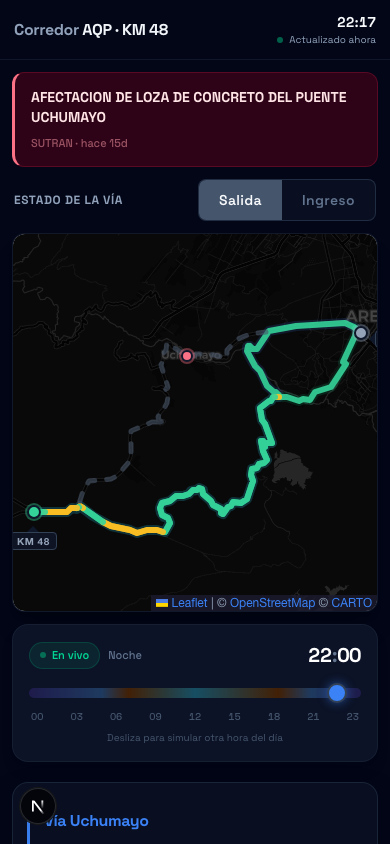
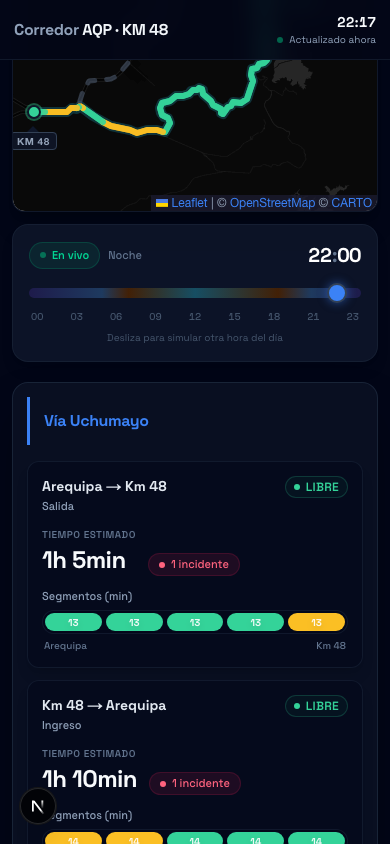

# TráficoAQP

Real-time traffic monitoring for the Arequipa ↔ Km 48 (La Repartición) corridor in Peru. Covers two routes: **Vía Uchumayo** and **Vía Cerro Verde**.

Built for the Arequipa community. Free, open-source, no ads.

---

### Screenshots

| Map view | Route cards & patterns |
|:--------:|:----------------------:|
|  |  |

*Live traffic map with speed-colored polylines (green/amber/red), SUTRAN incidents, and hourly congestion patterns per route.*

---

## What it does

- Polls Google Maps Routes API every 5 minutes for live speed data
- Renders speed-colored polylines on the map (green/amber/red)
- Shows 5-segment traffic cards per route and direction
- Displays real road incidents from SUTRAN (closures, restrictions)
- Detects closed road segments and renders them as dashed gray lines
- Provides hourly traffic pattern charts from learned data
- Time simulator to explore traffic at any hour of the day
- Direction toggle (Salida / Ingreso) to view either travel direction

## Tech stack

| Layer | Technology |
|-------|-----------|
| Framework | Next.js 16 (App Router) |
| Language | TypeScript (strict) |
| UI | React 19, Tailwind CSS v4 |
| Map | Leaflet + react-leaflet |
| Charts | Recharts |
| Data source | Google Maps Routes API |
| Incidents | SUTRAN GIS alerts |
| Database | SQLite via better-sqlite3 |
| Scheduler | node-cron (in-process) |
| Testing | Vitest |

## Prerequisites

- Node.js 20+ (LTS recommended)
- A Google Maps API key with **Routes API** enabled ([setup guide](docs/deployment.md#step-2--get-a-google-maps-api-key))

## Quick start

```bash
# Clone and install
git clone <repo-url>
cd trafico-aqp
npm install

# Configure environment
cp .env.example .env
# Edit .env and add your Google Maps API key

# Start development server
npm run dev
```

Open [http://localhost:3000](http://localhost:3000). The scheduler starts automatically and begins polling Google Maps for traffic data.

## Scripts

| Command | Description |
|---------|-------------|
| `npm run dev` | Start development server (port 3000) |
| `npm run build` | Production build |
| `npm run start` | Start production server |
| `npm test` | Run test suite (Vitest) |
| `npm run test:watch` | Run tests in watch mode |
| `npm run screenshots` | Capture README screenshots (requires `npm run dev` in another terminal) |
| `npm run lint` | Run ESLint |

## Project structure

```
trafico-aqp/
├── src/
│   ├── app/
│   │   ├── page.tsx                # Main page
│   │   ├── layout.tsx              # Root layout
│   │   ├── globals.css             # Global styles
│   │   └── api/
│   │       ├── traffic/current/    # Live + simulated traffic data
│   │       ├── traffic/patterns/   # Hourly averages
│   │       └── incidents/          # Active road incidents
│   ├── components/                 # UI components
│   ├── hooks/
│   │   └── useTrafficData.ts       # Core data hook
│   ├── lib/
│   │   ├── types.ts                # All TypeScript interfaces
│   │   ├── db.ts                   # SQLite schema and queries
│   │   ├── google-traffic.ts       # Google Maps API client
│   │   ├── sutran-scraper.ts       # SUTRAN incident scraper
│   │   ├── incident-matcher.ts     # Coordinate → route/segment matching
│   │   ├── map-utils.ts            # Closed road detection (static vs Google path)
│   │   ├── scheduler.ts            # Cron jobs (5-min poll, daily recompute)
│   │   ├── roads.ts                # Segment definitions, route configs
│   │   ├── colors.ts               # Congestion colors and thresholds
│   │   ├── traffic.ts              # Route summary calculation
│   │   ├── mock-data.ts            # Fallback data when DB is empty
│   │   ├── uchumayo-path.ts        # Static path (fallback)
│   │   └── cerro-verde-path.ts     # Static path (fallback)
│   └── instrumentation.ts          # Starts scheduler on boot
├── data/
│   └── traffic.db                  # SQLite database (auto-created, gitignored)
├── docs/                           # Architecture documentation
├── .env.example                    # Environment template
├── vitest.config.ts                # Test configuration
└── CLAUDE.md                       # AI coding guidelines
```

## Testing

Tests cover the critical bridge-recovery transition scenarios (what happens when Puente Uchumayo reopens):

```bash
npm test
```

Key test areas:
- **Closed road detection** — `findUncoveredSegments` correctly identifies which parts of the old road the Google detour bypasses
- **Incident lifecycle** — SUTRAN clearing an incident removes the dashed gray overlay; Google restoring the original route aligns with the static path
- **Transition safety** — all four combinations of SUTRAN/Google state changes are tested
- **Incident matcher** — coordinate-to-route matching works correctly for both corridors

## How it works

1. **Every 5 minutes**, the scheduler polls Google Maps Routes API for 4 route-direction combinations (2 routes × 2 directions)
2. Google returns an encoded polyline + speed intervals (NORMAL/SLOW/TRAFFIC_JAM) for each
3. The polyline is split into 5 equal-distance segments for the summary cards
4. Raw data is stored in SQLite; hourly averages are recomputed daily at 03:00
5. The frontend fetches current data via API routes and renders speed-colored polylines on the map
6. SUTRAN incidents are scraped every 5 minutes and displayed as markers on the map
7. When a critical incident exists, the closed portion of the old road is shown as a dashed gray line (detected by comparing the static path against Google's detour polyline)

When the API is unavailable, the app gracefully falls back to mock data generation.

## Documentation

| Document | Contents |
|----------|----------|
| [Data Pipeline](docs/data-pipeline.md) | Google Maps API integration, SQLite schema, polling schedule |
| [Route Data Model](docs/route-data-model.md) | Coordinate system, segments, map rendering, how to add routes |
| [Incidents](docs/incidents.md) | SUTRAN/PROVIAS data sources, scraping, segment matching |
| [Deployment](docs/deployment.md) | Self-hosted MacBook + Cloudflare Tunnel setup |
| [CLAUDE.md](CLAUDE.md) | AI coding guidelines and architecture rules |

## Deployment

Self-hosted on a MacBook in Arequipa via Cloudflare Tunnel. See [docs/deployment.md](docs/deployment.md) for the full setup guide.

Total cost: ~$10/year (domain only). Google Maps free tier covers our API usage.

## License

Community project by mathiasbc@gmail.com — Arequipa, Perú.
